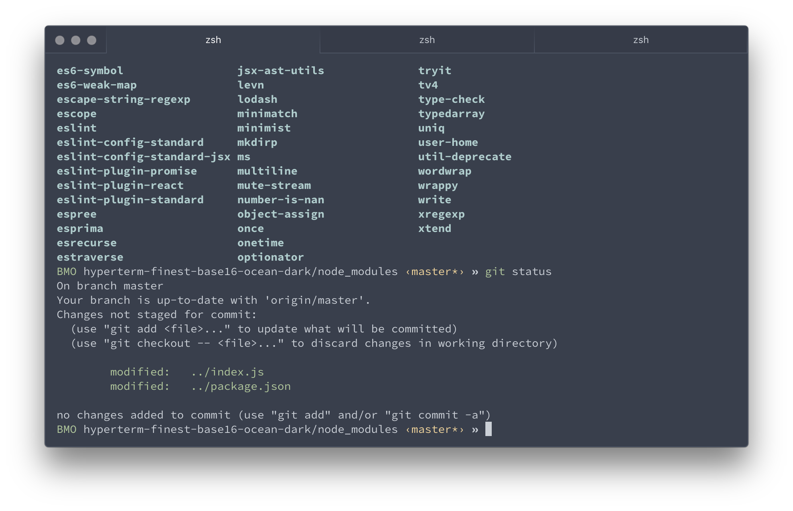

# The very finest Hyperterm Base16 Ocean Dark theme

Inspired by the Spacegray dark theme by @mxstbr. The name is a joke -- I actually just built this theme for fun and thought I'd share it. Then I saw there were already two other versions... so I needed a cheeky name!  



## Installation

  1. Open up your ~/.hyperterm.js in your favorite code editor
  2. Add `hyperterm-finest-base16-ocean-dark` to your plugins array like so:
   
      ```
      plugins: [
        'hyperterm-finest-base16-ocean-dark',
      ],
      ```
  3. Fully reload Hyperterm (Cmd+Shift+R) 

## License

MIT
